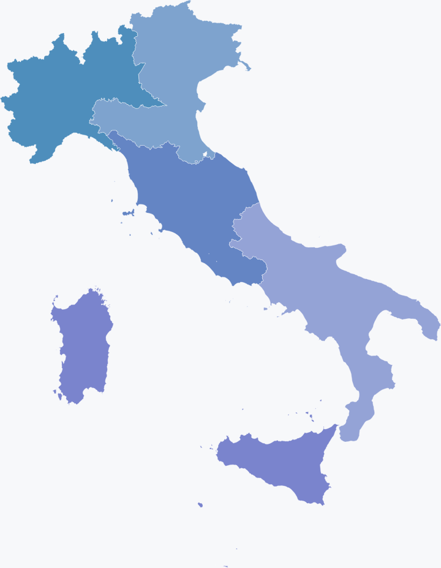
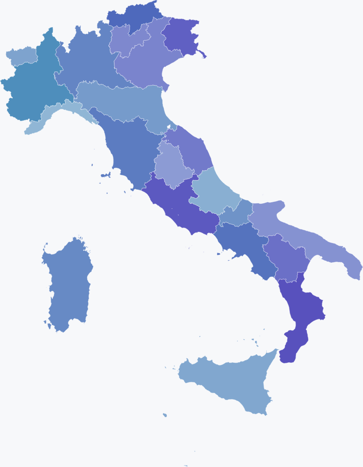
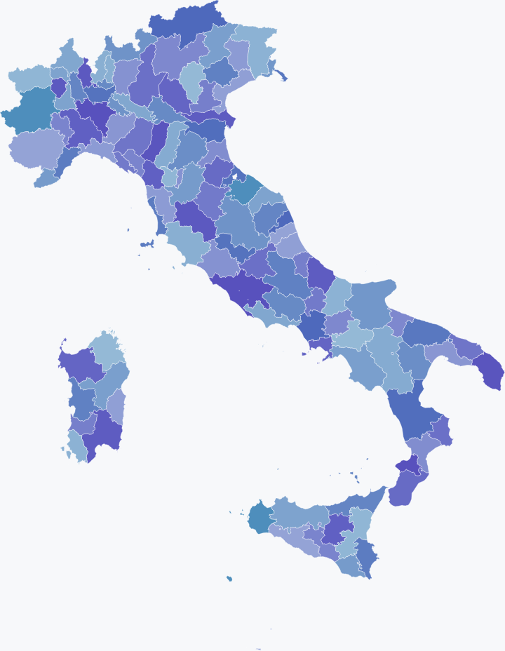
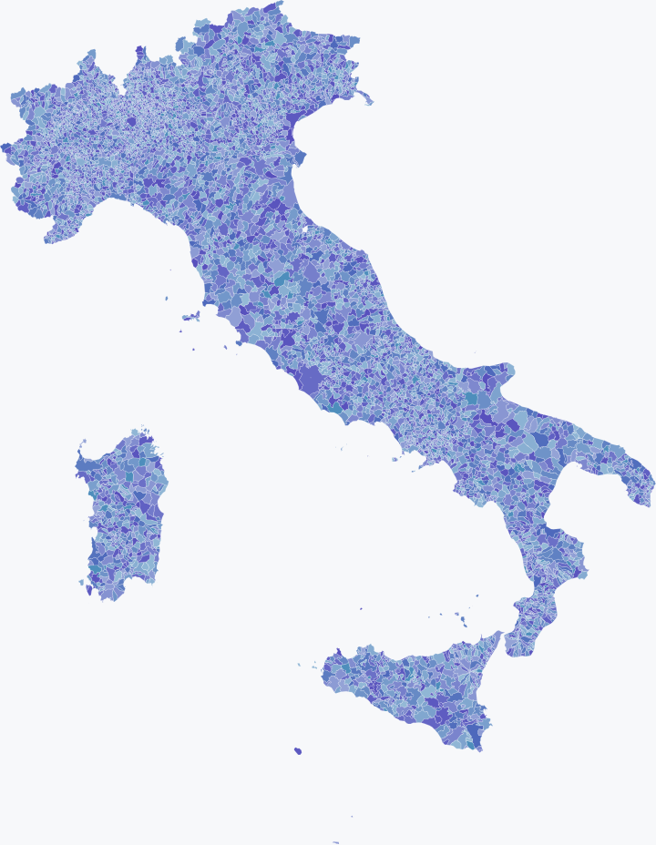
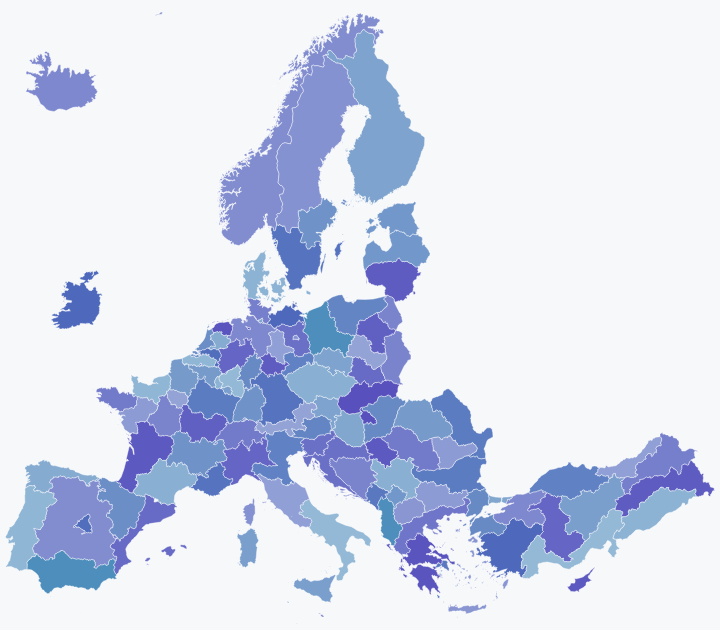
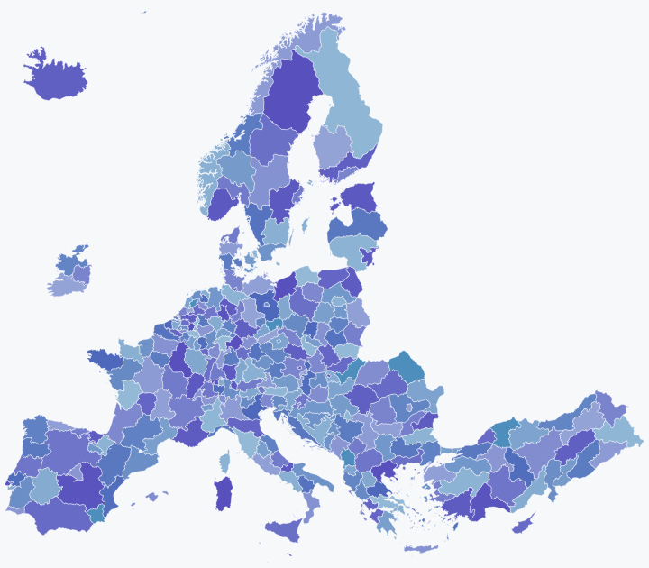
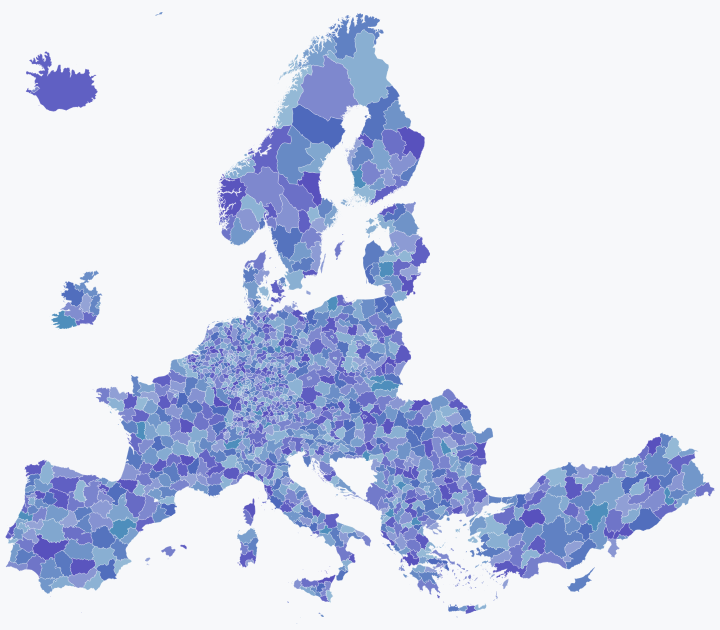
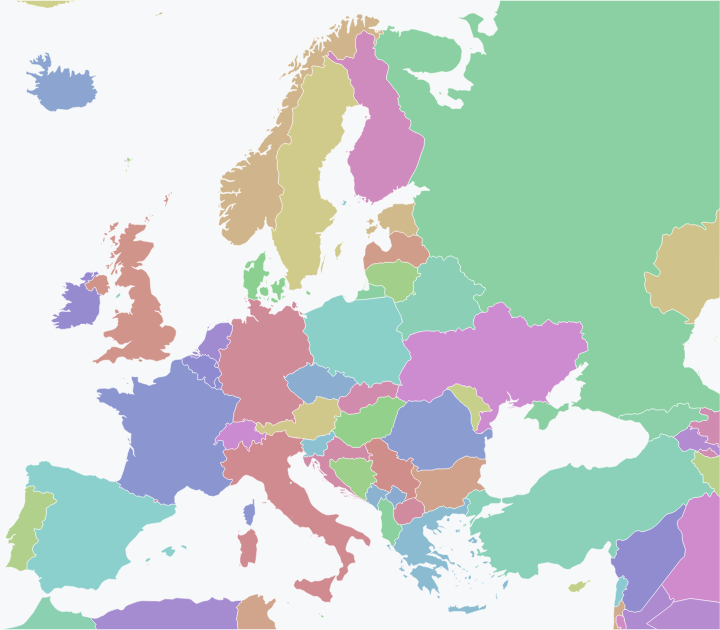
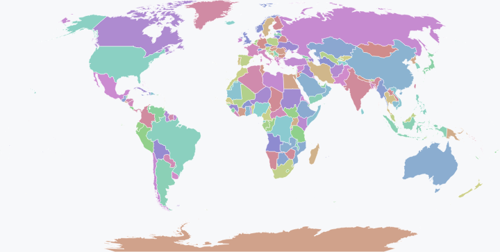

# Boundaries

Ready-to-draw administrative and statistical boundaries for Italy and
for Europe, as SVG paths in plain JSON. Every shape carries the
identifiers statistical providers use for that place. Tables keyed by
matching ISTAT, NUTS, licence-plate or ISO codes can be joined directly
after checking their territorial level and classification vintage.

Nine files, 10,001 shapes, 4.1 MB in total. No runtime, no dependencies:
a file is a JSON document a browser can draw with one `<svg>` element.

| File | Shapes | Level | Identifiers on each shape | Source | Licence |
| --- | ---: | --- | --- | --- | --- |
| `italy-macro-areas.geo.json` | 5 | Italian macro-areas (ripartizioni, NUTS 1) | ripartizione number (`2`), the NUTS 1 code ISTAT publishes under (`ITD`) and the NUTS 2024 code (`ITH`) | ISTAT, 1 January 2026 | CC BY 4.0 |
| `italy-regions.geo.json` | 22 | Italian regions (NUTS 2), plus the autonomous provinces of Trento and Bolzano and Trentino-Alto Adige as a whole | ISTAT region code (`05`), NUTS 2 code in both vintages (`ITD3`, `ITH3`), name as written and in upper case (`Veneto`, `VENETO`) | ISTAT, 1 January 2026 | CC BY 4.0 |
| `italy-provinces.geo.json` | 110 | Italian provinces and metropolitan cities (NUTS 3) | ISTAT province code (`015`), NUTS 3 code (`ITC4C`), licence plate (`MI`) | ISTAT, 1 January 2026 | CC BY 4.0 |
| `italy-municipalities.geo.json` | 7,896 | Italian municipalities (LAU) | ISTAT municipality code (`015146`); 377 municipalities also carry the code they had under an earlier provincial layout | ISTAT, 1 January 2026 | CC BY 4.0 |
| `europe-nuts1.geo.json` | 111 | NUTS 1 regions of Europe | NUTS 2024 code (`DE2`) | Eurostat GISCO, NUTS 2024 | Non-commercial, © EuroGeographics |
| `europe-nuts2.geo.json` | 291 | NUTS 2 regions of Europe | NUTS 2024 code (`ES51`) | Eurostat GISCO, NUTS 2024 | Non-commercial, © EuroGeographics |
| `europe-nuts3.geo.json` | 1,330 | NUTS 3 regions of Europe | NUTS 2024 code (`FR101`) | Eurostat GISCO, NUTS 2024 | Non-commercial, © EuroGeographics |
| `europe.geo.json` | 59 | Countries of Europe and its margins (NUTS 0) | ISO 3166-1 alpha-2 (`DE`), alpha-3 (`DEU`), and the Eurostat code where it differs (`EL`, `UK`) | Natural Earth, 1:50m | Public domain |
| `world.geo.json` | 177 | Countries of the world | ISO 3166-1 alpha-2, alpha-3, and the Eurostat code where it differs | Natural Earth, 1:50m | Public domain |

The shapes carry no population, area, postal code or cadastral code.
They are simplified for drawing at screen resolution and are not
suitable for measuring areas, distances or legal boundaries.

## Preview

Each file drawn as it is, one colour per shape, from the `preview/`
directory.

| | |
| --- | --- |
| **italy-macro-areas**  | **italy-regions**  |
| **italy-provinces**  | **italy-municipalities**  |
| **europe-nuts1**  | **europe-nuts2**  |
| **europe-nuts3**  | **europe**  |
| **world**  | |

## Format

Each file is one JSON object:

```json
{
  "viewBox": "0 0 1000 1288.1",
  "source": "ISTAT, Confini delle unità amministrative a fini statistici, 1 gennaio 2026 (generalizzati), CC BY 4.0",
  "shapes": [
    { "name": "Veneto", "aliases": ["05", "Veneto", "VENETO", "ITD3", "ITH3"], "d": "M600.2,131.4L…Z" }
  ]
}
```

- `viewBox` is the SVG view box every path in the file is drawn into.
  The four Italian files share one view box and one projection, and so
  do the three European NUTS files, so levels of one country drawn
  together line up.
- `source` names the upstream dataset and its licence, so a file copied
  on its own still says where it came from.
- `shapes[].name` is the official name of the place.
- `shapes[].aliases` are the identifiers the place is known by. Match a
  row of data against any of them within the selected boundary file.
  An alias is not a crosswalk between arbitrary territorial vintages.
- `shapes[].d` is the SVG path, already projected and simplified.
- The three European NUTS files also carry `outside`: the codes of the
  regions the file does not draw because they lie outside its frame
  (the Canaries, Madeira, the Azores, the French overseas regions,
  Svalbard).

To draw a file:

```html
<svg viewBox="0 0 1000 1288.1">
  <path d="…" fill="#dfe6ee" stroke="#fff" stroke-width="0.5" />
</svg>
```

## Numbers to draw on these shapes

The identifiers support joins with official statistics. The companion
repositories provide discovery metadata and its publishing code, not the
numeric observations:

| Where | What it holds | What it is for |
| --- | --- | --- |
| **This repository** | the shapes, each with its ISTAT, NUTS and ISO identifiers | drawing a table of numbers on a map |
| [**Gramscii-IT/open-data-catalogue**](https://huggingface.co/datasets/Gramscii-IT/open-data-catalogue) on Hugging Face | discovery metadata from statistical and Italian public-finance providers; release counts and coverage belong to the snapshot manifest and quality report | finding datasets and inspecting their recorded dimensions, codes and documentation |
| [**Gramscii-Git/open-data-catalogue**](https://github.com/Gramscii-Git/open-data-catalogue) on GitHub | catalogue release policy, validation and publication code | validating an export from the SDG harvester and publishing a verified immutable revision |

A dataset in the catalogue is cut by a territorial dimension whose codes
are aliases of the shapes here: ISTAT's `REF_AREA` code `ITE4` is Lazio
in `italy-regions.geo.json`, Eurostat's `geo` code `IT` is Italy in
`europe.geo.json`, OECD's and ILO's `REF_AREA` code `AFG` is Afghanistan
in `world.geo.json`, and the ISTAT municipality codes of the Italian
public-finance sources land on `italy-municipalities.geo.json`. A row of
that dataset can colour a matching shape. These examples do not establish
coverage of every dataset or territorial vintage.

### Selection and map joins

This repository contains geometry, not a list of available observations.
A shape does not prove that a provider has data for a particular date,
territory or filter. The shared joint-availability artifact belongs in
`open-data-catalogue`; its publisher documentation states which stages
are implemented. Do not infer that an index has been published from the
presence of these boundary files.

Before drawing observations:

- Verify the selected file's SHA-256 at a pinned repository revision.
- Check the territorial level and vintage against the source dataset.
  Historical aliases do not account for arbitrary mergers, splits or
  changes of area.
- Use one dataset, period, measure, unit and filter combination per map.
  Treat multiple rows or codes mapping to the same shape as an explicit
  ambiguity, not permission to overwrite a value or invent an aggregate.
- Keep missing or suppressed values distinct from numeric zero. Report
  unmatched codes and regions listed in `outside` separately from places
  with no observation.

Adding selection metadata or updating numeric observations does not
require regenerating geometry. A boundary update requires a qualified
source release and new checksums.

## How the files were made

### Italy

Source: ISTAT, *Confini delle unità amministrative a fini statistici al
1° gennaio 2026*, the generalised release `Limiti01012026_g.zip`
(SHA-256 `b011a590656c3a3ebc297fba80726a376aa843b6f164641cf6a4a990021a81d6`,
as served by ISTAT on 7 September 2026), read from the shapefiles
`RipGeo01012026_g`, `Reg01012026_g`, `ProvCM01012026_g` and
`Com01012026_g`. The coordinates in that release are UTM zone 32N
eastings and northings.

1. One transform is computed from Italy's own bounding box and applied to
   all four levels: the country is drawn 1,000 units wide, the height
   follows from its shape, nothing is stretched.
2. Each polygon is simplified with topology preserved, with a tolerance
   of 250 metres for macro-areas, regions and provinces and 500 metres
   for municipalities. At this width one unit is about one kilometre, so
   a boundary moves by less than a pixel.
3. Each polygon is written as an SVG path with one decimal of precision.
4. Identifiers are attached from ISTAT's own classification: ripartizione,
   region, province and municipality codes, NUTS codes, licence plates,
   and for municipalities the codes they carried under an earlier
   provincial layout, so data keyed by either vintage lands on the same
   shape. NUTS 2010 renamed Italy's `ITD` to `ITH` and `ITE` to `ITI`;
   ISTAT still publishes under the old letters and Eurostat under the
   new, so macro-areas and regions carry both.

### European NUTS regions

Source: Eurostat GISCO, *NUTS 2024*, region polygons at 1:3 million in
EPSG:3035, file `NUTS_RG_03M_2024_3035.geojson` (SHA-256
`b6c44e3ed6c1d8e33b98ba36fe8236f3c4b2bdc005049bb37320574be1601e33`).

1. One frame is fixed around the continent, from the Atlantic coast of
   Portugal to Cyprus and from Crete to the North Cape (EPSG:3035
   x 2,600–7,350 km, y 1,350–5,500 km), and applied to all three levels:
   the frame is drawn 1,000 units wide.
2. Each polygon is clipped to the frame. A region lying wholly outside
   it is not drawn and its code is listed under `outside`; Svalbard, off
   the top of Norway, is cut away.
3. Each polygon is simplified with topology preserved, with a tolerance
   of 1,500 metres for NUTS 1 and 2 and 1,000 metres for NUTS 3. At this
   width one unit is about 4.75 kilometres, so a boundary moves by less
   than a third of a pixel.
4. Each polygon is written as an SVG path with one decimal of precision,
   named by its Latin name and identified by its NUTS 2024 code.

### Europe and the world

Source: Natural Earth, *Admin 0 – Countries*, 1:50m scale.

1. The country polygons are projected: Lambert azimuthal equal-area for
   `europe.geo.json`, which keeps the European polygons only, and
   Robinson for `world.geo.json`.
2. Each polygon is simplified for screen resolution and written as an
   SVG path in a 1,000-unit-wide view box.
3. ISO 3166-1 alpha-2 and alpha-3 codes are attached, plus the Eurostat
   country code where it differs from ISO (`EL` for Greece, `UK` for the
   United Kingdom), so Eurostat tables colour the map directly.

The Natural Earth release archive these two files were made from is not
pinned by checksum. Regenerating them means recording that input first.

## Integrity

The files distributed here are identified by these SHA-256 digests, also
listed in `SHA256SUMS`. They identify the adapted files in this
repository, not the upstream archives.

| File | SHA-256 |
| --- | --- |
| `italy-macro-areas.geo.json` | `7a7cd481b2860b8a7c232d192fdd55fa86ebb75b6a9552f568059bf49c7d4b9f` |
| `italy-regions.geo.json` | `7963e74dc142126cc2807bef0be26d4117031851a08622fae9dd04c267f8ef26` |
| `italy-provinces.geo.json` | `292b3a4bd42844846519e8271466d23e96cf207861cad858e1c238da416ca798` |
| `italy-municipalities.geo.json` | `c0759f670a54920772b2cafd1541717e34c17b2a44cb970d0a7f05a502673420` |
| `europe-nuts1.geo.json` | `25ced35220f9d1dc5ef3573f6e9989b6de7859472d311fbac9b5e7bfa2a90539` |
| `europe-nuts2.geo.json` | `6cf445662590b8ca7c17ff3394c1d7f3ae3febb32fa28eea6cedec236fc45eac` |
| `europe-nuts3.geo.json` | `6f0c585c165fc4aa01651f51c3c20e1d86de1a042df240f81f9c6ff2226675da` |
| `europe.geo.json` | `a4f787145ac330c17426ec734d3784d0d13665e2fdf98ab76fc8b976572492d3` |
| `world.geo.json` | `13d478295fa33bb49531878f637188559b570c3b673df6f8b1b458e7f444af62` |

```sh
shasum -a 256 -c SHA256SUMS
```

## Licences

Each file carries the terms of the dataset it was adapted from, and
those terms are not the same for every file. Read the row of the table
above for the file you use; the details are here.

**Gramscii's adaptation** (projection, simplification, SVG paths and the
identifiers attached to each shape) is released for every file under the
[Creative Commons Attribution 4.0 International](LICENSE) licence. That
licence covers what Gramscii added, never the source data beneath it:
where the source is more restrictive, the source's terms decide what you
may do with the file.

**ISTAT files** (`italy-macro-areas`, `italy-regions`, `italy-provinces`,
`italy-municipalities`) are adapted from data ISTAT publishes under
[CC BY 4.0](https://creativecommons.org/licenses/by/4.0/). You may use
them for any purpose, including commercially, with this attribution:

> ISTAT, Confini delle unità amministrative a fini statistici,
> 1 gennaio 2026 (generalizzati), CC BY 4.0

ISTAT's open-data terms: <https://www.istat.it/dati/open-data/>.

**Eurostat GISCO files** (`europe-nuts1`, `europe-nuts2`, `europe-nuts3`)
are adapted from data Eurostat distributes under its own
[terms](GISCO-NUTS.md): non-commercial use only, with this copyright
notice visible on any printed or electronic publication using the data:

> © EuroGeographics for the administrative boundaries

Commercial use of these three files needs a licence from
[EuroGeographics](https://eurogeographics.org/). Gramscii's CC BY 4.0 on
its adaptation does not lift that condition.

**Natural Earth files** (`europe`, `world`) are adapted from data its
authors place in the [public domain](NATURAL-EARTH.md). You may use them
for any purpose; no attribution is required by the source, and Natural
Earth welcomes it.

When you use a file, credit the file's source, as written in its
`source` field, and this repository:

> Boundaries by Gramscii, CC BY 4.0, https://github.com/Gramscii-Git/boundaries

## Origin

These files are the map layer of Semantic Deterministic Graph,
Gramscii's deterministic answer engine, and are published here on their
own so that anyone drawing Italian or European statistics can use them.
The copies inside that project and the files here are byte-identical:
the digests above are the proof.
